# Predicting On-Time Delivery in E-Commerce Shipments

A machine learning project that predicts whether a customer's product will reach them on time, using the E-Commerce Shipping Dataset. The pipeline covers exploratory data analysis, preprocessing, and a comparison of four models: a feed-forward neural network, Gaussian Naive Bayes, Logistic Regression, and K-Means clustering.

---

## Table of Contents

- [Dataset](#dataset)
- [Exploratory Data Analysis](#exploratory-data-analysis)
- [Data Preprocessing](#data-preprocessing)
- [Models](#models)
- [Results](#results)
- [How to Run](#how-to-run)
- [Tech Stack](#tech-stack)
- [Acknowledgement](#acknowledgement)

---

## Dataset

The dataset contains **10,999 records** and **12 columns** describing shipments from an international e-commerce company.

| Feature | Type | Description |
|---|---|---|
| `ID` | int | Record identifier (dropped during preprocessing) |
| `Warehouse_block` | categorical | Warehouse block the product shipped from (A–F) |
| `Mode_of_Shipment` | categorical | Flight, Ship, or Road |
| `Customer_care_calls` | int | Number of calls made about the shipment |
| `Customer_rating` | int | Customer rating from 1 (worst) to 5 (best) |
| `Cost_of_the_Product` | int | Product cost in USD |
| `Prior_purchases` | int | Number of prior purchases by the customer |
| `Product_importance` | categorical | low / medium / high |
| `Gender` | categorical | M / F |
| `Discount_offered` | int | Discount on the product |
| `Weight_in_gms` | int | Product weight in grams |
| `Reached.on.Time_Y.N` | binary | **Target.** 1 = did *not* reach on time, 0 = reached on time |

There are **no missing values** in any column.

**Class balance:** roughly 59.7% of shipments belong to class 1 and 40.3% to class 0 — a mild imbalance that was handled with stratified splitting and class weights.

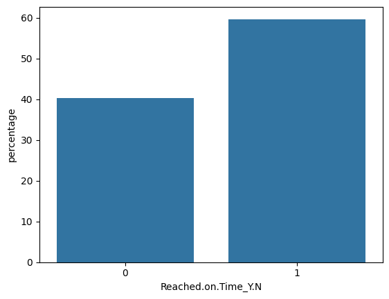

*Bar plot of the percentage split of `Reached.on.Time_Y.N`*

---

## Exploratory Data Analysis

Features were separated into 7 quantitative and 5 categorical groups, then profiled with descriptive statistics, variance, and skewness.

### Distributions

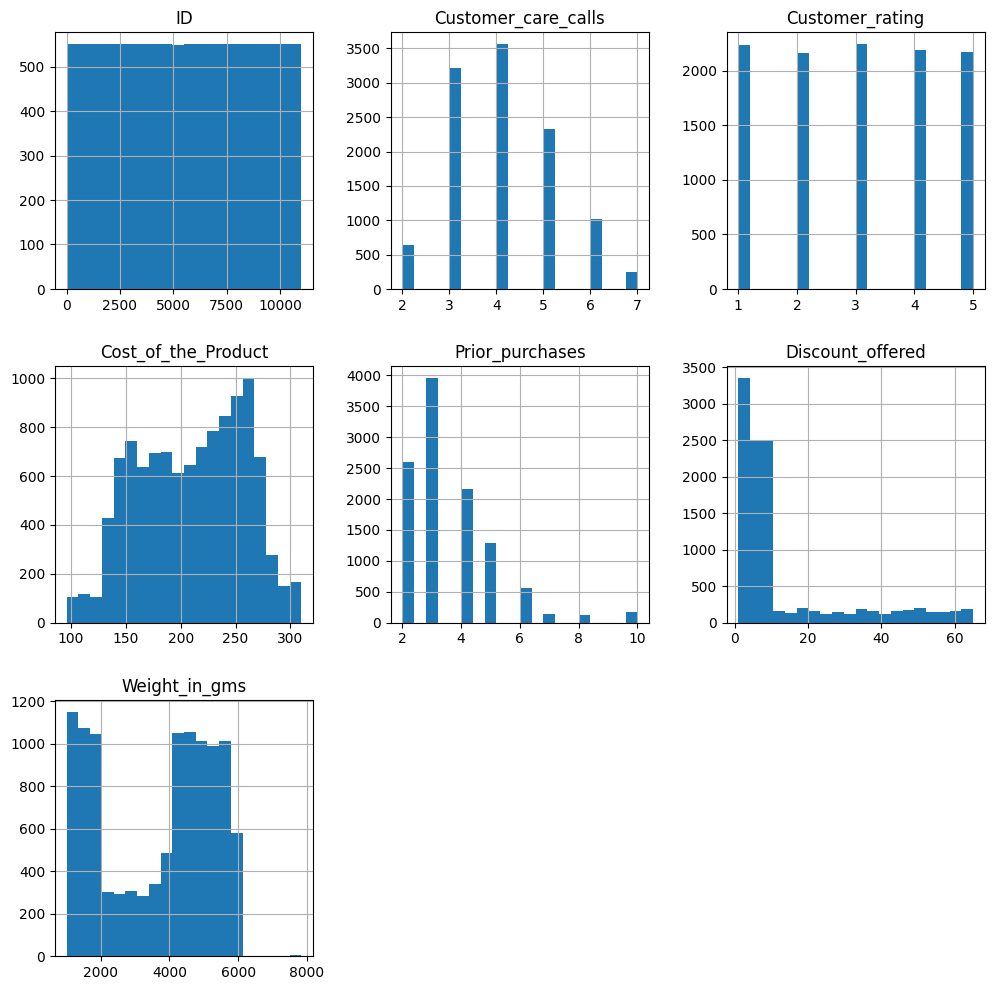

*Grid of histograms for all quantitative features*

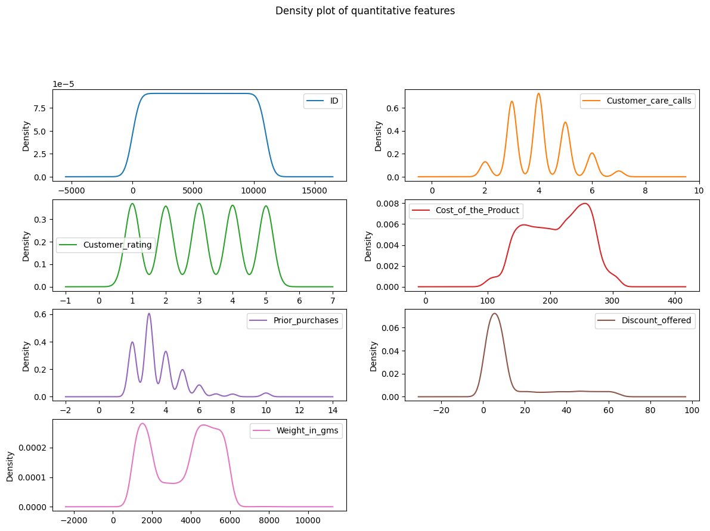

*Density plot subplot grid for quantitative features*

### Skewness

| Feature | Skew | Interpretation |
|---|---|---|
| `ID` | 0.000 | Perfectly symmetrical |
| `Customer_care_calls` | 0.392 | Fairly symmetrical |
| `Customer_rating` | 0.004 | Fairly symmetrical |
| `Cost_of_the_Product` | −0.157 | Fairly symmetrical |
| `Prior_purchases` | 1.682 | Highly right-skewed |
| `Discount_offered` | 1.797 | Highly right-skewed |
| `Weight_in_gms` | −0.250 | Fairly symmetrical |

`Prior_purchases` and `Discount_offered` were flagged for transformation because strong skew can bias the models.

### Outliers

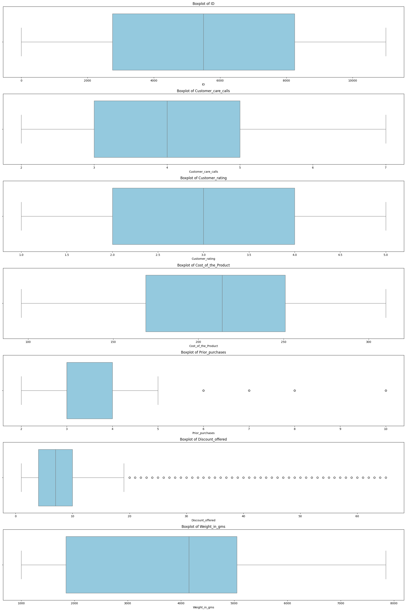

*Stacked boxplots for each quantitative feature*

### Categorical features

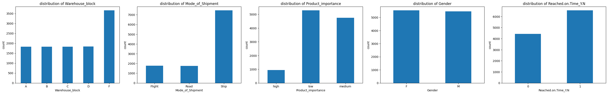

*Value-count bar plots for categorical features*

### Correlation

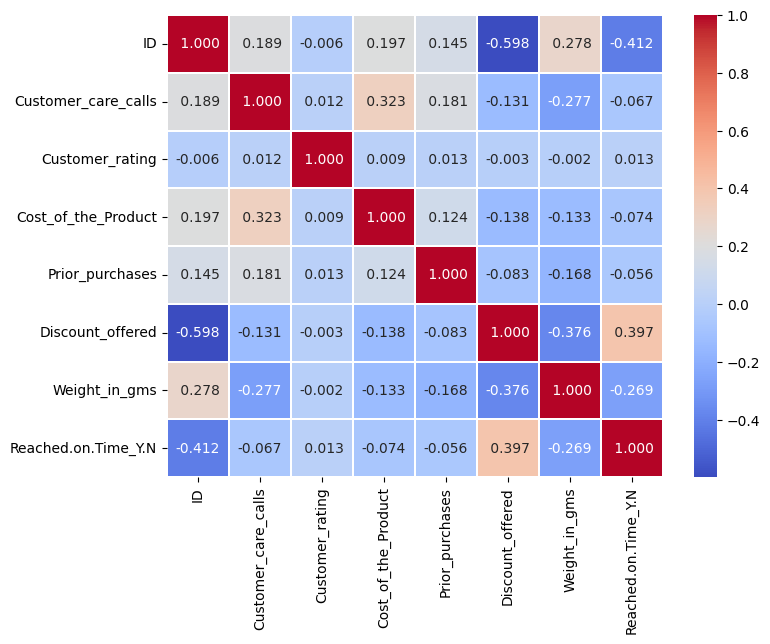

*Annotated correlation matrix heatmap of the numeric features*

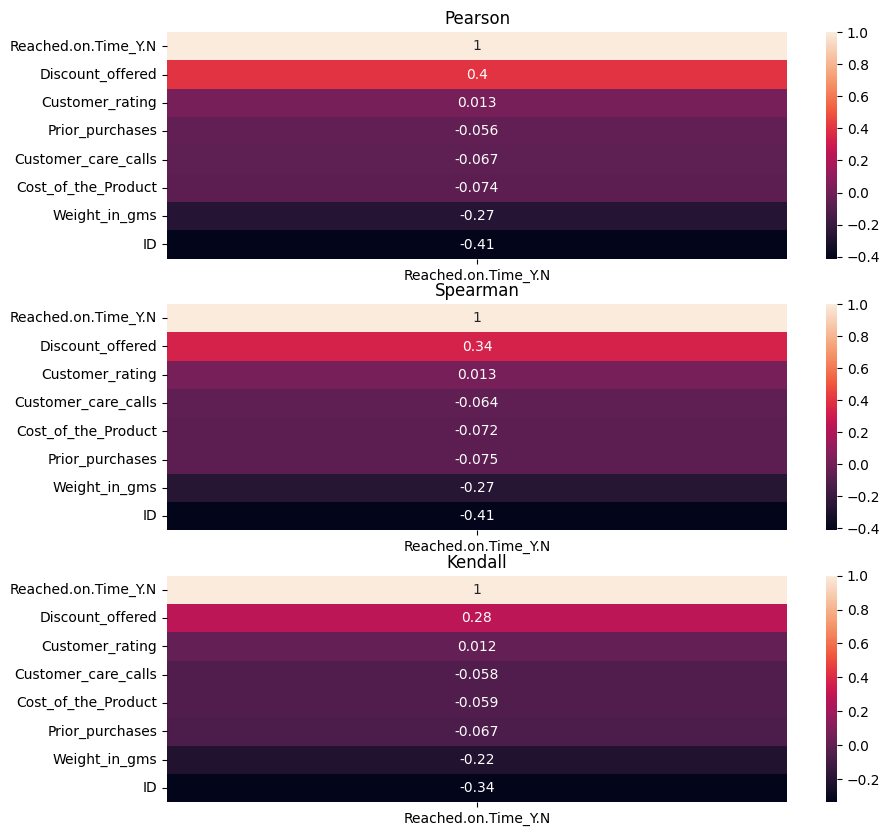

*Pearson, Spearman, and Kendall correlation of each feature with the target*

---

## Data Preprocessing

The notebook works through four faults in the raw data:

**1. Irrelevant feature.** `ID` carries no predictive signal and was dropped.

**2. Categorical data.**
- One-hot encoding for the nominal features `Warehouse_block` and `Mode_of_Shipment` (with `drop_first=True` to avoid redundant columns).
- Label encoding for `Product_importance` (`low→1`, `medium→2`, `high→3`) and `Gender` (`F→0`, `M→1`).
- The target was cast back to `int64` for modelling.

**3. Skewness and outliers.** After an 80–20 stratified train-test split, a `log1p` transformation followed by `RobustScaler` was applied to `Prior_purchases` and `Discount_offered`:

| Feature | Skew before | Skew after |
|---|---|---|
| `Prior_purchases` | 1.682 | 0.670 |
| `Discount_offered` | 1.797 | 0.527 |

**4. Feature scaling.** `StandardScaler` was applied to `Customer_care_calls`, `Customer_rating`, `Cost_of_the_Product`, and `Weight_in_gms`.

The split is performed **before** any transformation or scaling so that no test-set information influences the training pipeline.

---

## Models

### Neural Network (Keras Sequential)

| Layer | Units | Activation |
|---|---|---|
| Dense | 64 | ReLU |
| Dense | 32 | ReLU |
| Dense | 1 | Sigmoid |

Optimizer: Adam (lr = 0.001) · Loss: Binary Crossentropy · 50 epochs · batch size 32 · balanced class weights computed from the training labels.

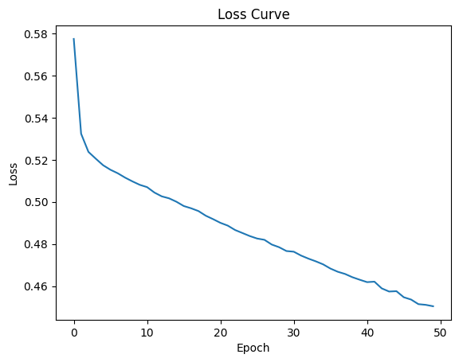

*Training loss versus epoch for the neural network*

### Gaussian Naive Bayes

A `GaussianNB` baseline trained on the same scaled features.

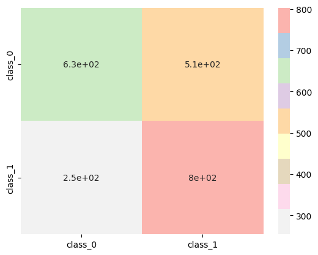

*Confusion matrix for the Naive Bayes classifier*

### Logistic Regression

A `LogisticRegression` baseline with default hyperparameters.

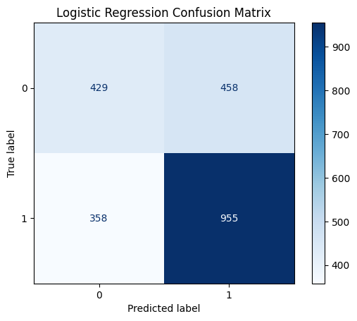

*Confusion matrix for Logistic Regression*

### K-Means (unsupervised)

`KMeans` with `n_clusters=2` was fitted on the training features, and each cluster was mapped to the majority true label to measure how well the natural cluster structure aligns with on-time delivery. This reached **64.36%** agreement on the training set.

---

## Results

All supervised metrics are measured on the held-out 20% test set.

| Model | Accuracy | Precision | Recall | AUC |
|---|---|---|---|---|
| **Neural Network** | **66.68%** | **0.8040** | 0.5842 | **0.7368** |
| Gaussian Naive Bayes | 65.27% | 0.7597 | 0.6116 | 0.6626 |
| Logistic Regression | 62.91% | 0.6759 | **0.7273** | 0.6055 |
| K-Means (train, unsupervised) | 64.36% | — | — | — |

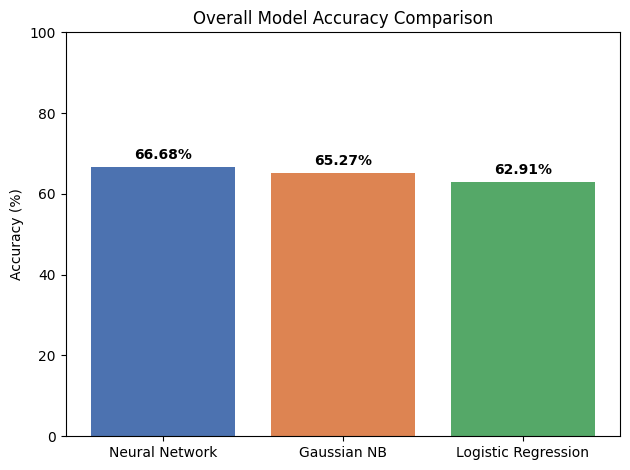

*Bar chart comparing test accuracy across the three supervised models*

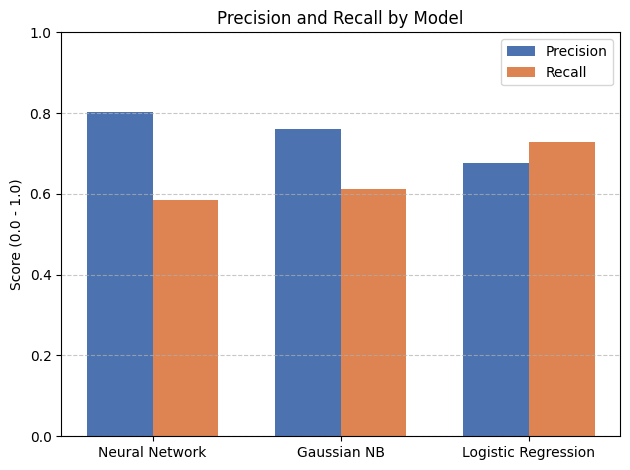

*Grouped bar chart of precision and recall per model*

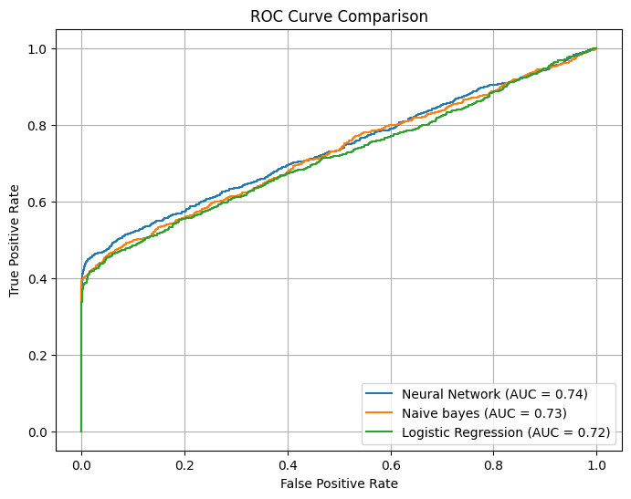

*ROC curves with AUC values for all three models*

**Takeaways**

- The neural network is the strongest overall, leading on accuracy, precision, and AUC. Its high precision with lower recall means it is conservative: when it flags a shipment as delayed it is usually right, but it misses a share of actual delays.
- Logistic Regression flips that trade-off, catching the most delayed shipments at the cost of more false alarms. Which model is preferable depends on whether missed delays or unnecessary alerts are more expensive for the business.
- The margin between all four approaches is narrow, and K-Means reaching 64% without labels suggests much of the separability comes from a small number of dominant features rather than complex interactions.

---

## How to Run

1. Clone the repository and open `code.ipynb` in Google Colab or Jupyter.
2. Place `E-commerce Shipping Dataset.csv` in a folder and point the `BASE` variable at it. In Colab this means mounting Drive:
   ```python
   from google.colab import drive
   drive.mount('/content/drive')
   BASE = "/content/drive/My Drive/your/path/here"
   ```
   For a local run, set `BASE` to the directory holding the CSV and skip the Drive cells.
3. Run the cells top to bottom.

---

## Tech Stack

`Python` · `pandas` · `NumPy` · `Matplotlib` · `Seaborn` · `scikit-learn` · `TensorFlow / Keras` · `SciPy` · `Google Colab`

---

## Acknowledgement

This project was completed as part of the **Artificial Intelligence (CSE422)** course. It was a collaborative effort with [znix17](https://github.com/znix17).
